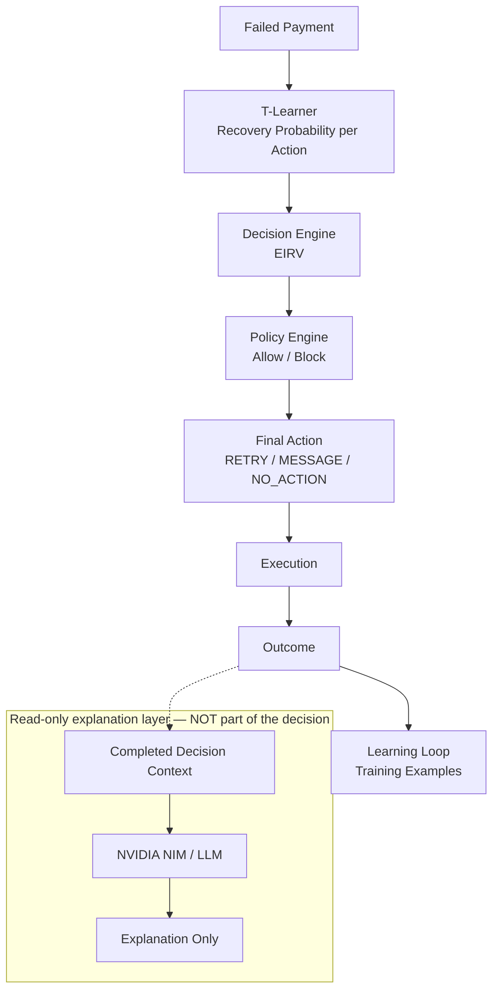

 # RecoverAI

**An AI Revenue Recovery Decision Engine for merchants.**

Built for the Razorpay AI Buildathon — Track 3 (AI Revenue Recovery).

> When a payment fails, RecoverAI decides whether intervening is actually
> worth it, which intervention is most likely to create **incremental**
> recovered revenue, and when to stop — all under merchant policy,
> privacy, and financial-safety constraints.

Full documentation lives in [`/docs`](docs/README.md). That directory is the
canonical specification for this project — if anything here or in prior
discussion conflicts with an approved doc in `/docs`, the doc wins.

---

## Why this exists

Generic "smart retry" already exists (Stripe Smart Retries, Chargebee Smart
Dunning, Razorpay's own retry tooling). RecoverAI is not another retry timer.
It answers a harder question for every revenue-at-risk event:

```
Is this worth intervening on at all?
If yes — which action (RETRY / MESSAGE / NO_ACTION for the MVP; concrete
message channels and VOICE are post-MVP) maximizes INCREMENTAL recovered
revenue, not just raw recovery?
When should we stop trying?
```

See [`docs/product/problem-statement.md`](docs/product/problem-statement.md)
for the full reasoning and [`docs/decisions/architecture-decisions.md`](docs/decisions/architecture-decisions.md)
for why this scope was chosen over alternatives (AI Commerce Gateway, Fraud
Ring Investigator, etc.) that were seriously considered.

## The core loop

```
EVENTS → DATA → ML PREDICTION → INCREMENTAL VALUE → OPTIMIZATION
       → POLICY → CONTROLLED ACTION → MEASURED OUTCOME → LEARNING
```

The LLM (NVIDIA NIM) never controls money directly. It
investigates, explains, and drafts customer messages. Every action that
touches a payment goes through a deterministic policy engine first. See
[`docs/architecture/decision-flow.md`](docs/architecture/decision-flow.md).

## Architecture



RecoverAI separates prediction from decision-making. The T-Learner predicts
recovery probability for each candidate action. The Decision Engine uses
those predictions and economic factors to calculate EIRV and select a
recommendation. The Policy Engine then determines whether that
recommendation is allowed, producing the `final_action` (which may differ
from the recommendation). Execution and outcome are recorded separately,
and outcomes can become training examples for the learning loop. **NVIDIA
NIM is a read-only explanation layer and does not participate in the
financial decision** — it never predicts recovery probability, calculates
EIRV, selects the final action, or overrides policy.

## Repository layout

```
recoverai/
├── frontend/         Next.js + TypeScript dashboard
├── backend/          FastAPI service (API, decision engine, policies, integrations)
├── ml/               Feature engineering, models, training, evaluation
├── simulation/       Synthetic payment/customer/merchant data generator + hidden ground truth
├── tests/            Tests mirroring backend/ml/decision_engine/simulation
├── docs/             Canonical project specification (start here)
├── scripts/          One-off / dev utility scripts
├── infrastructure/   Docker and deployment config
└── docker-compose.yml
```

## Status

**Phases 0 through 6 are complete** — data contract, persistence layer,
synthetic-data simulator, ML/decision-engine, uplift modelling, the
end-to-end recovery flow + API, and the frontend dashboard. The system is
demoable end-to-end from a clean `docker compose up --build`. Detail on
every phase follows below; see `docs/README.md` for the authoritative
phase table.

This repository has completed **Phase 0 → Phase 1A** — the full
`/docs` **data contract**: initialization, two spec-correction passes,
and Phase 1A.1–1A.4 (Core; Decision; Model/Policy/Experiment; Training
data). Entities finalized: `Merchant`, `Payment`, `PaymentEvent`,
`RecoveryCase`, `Prediction`, `DecisionRecord`, `PolicyEvaluation`,
`Intervention`, `Outcome`, `ModelVersion`, `Policy`, `Experiment`,
`ExperimentAssignment`, `TrainingExample`. All documentation only; see
ADR-007 through ADR-012 in
[`docs/decisions/architecture-decisions.md`](docs/decisions/architecture-decisions.md).
**Phase 1B — Data Layer Implementation is complete:** the contract is
realized as SQLAlchemy models (**17 application tables** — 14 finalized
Phase 1A entities + `customer`, `recovery_case_status_history`,
`display_id_sequence`; an 18th, Alembic's own `alembic_version`, appears
in a migrated PostgreSQL database) in `backend/models/`, a repository
layer in `backend/repositories/`, Pydantic schemas in `backend/schemas/`,
and an Alembic migration; `docker compose up` brings up Postgres →
migration → backend → `/health`.

**Phase 2 — Simulator & Synthetic Data is complete:** `simulation/` is a
fast, deterministic generator (default seed 42) that produces merchants,
customers, failed payments and multi-cycle recovery decisions through the
existing Phase 1B repositories, with **hidden per-action ground truth**
(`P(recovery | RETRY / MESSAGE / NO_ACTION)`) written to a JSON sidecar
under `simulation/ground_truth/runs/` — never into the database and read
only by `simulation/evaluation/`. One command:
`python -m simulation.cli generate` (sizes `small` 100 / `development`
1,000 / `training` 10,000). Simulator costs and probabilities are
synthetic assumptions, **not Razorpay pricing or behaviour**.

**Phase 3 — ML model, training & decision-engine integration is complete:**
a logistic-regression **S-learner** (`ml/`) trains from persisted
`TrainingExample` rows (case-level split, no leakage), predicts
`P(recovery | features, action)` for `RETRY` / `MESSAGE` / `NO_ACTION`,
is saved as a joblib artifact under `ml/models/artifacts/` and registered
as an immutable `ModelVersion` (`DRAFT → VALIDATED → PROMOTED`, one
`PROMOTED` per `model_role`). A deterministic **decision engine**
(`backend/decision_engine/` + `backend/policies/`) turns those
per-action `Prediction`s into EIRV → recommendation → policy veto →
`final_action`, persisting one `DecisionRecord` per cycle (three
`Prediction`s, one `PolicyEvaluation` per candidate checked,
`Intervention` only for `RETRY`/`MESSAGE`).

**Phase 4 — incremental / uplift modelling is complete:** four candidates
behind a common interface (`ml/models/uplift.py`) — the Phase 3
S-learner, a **T-learner** (one logistic head per action), a shallow
decision-tree S-learner, and a deterministic LightGBM S-learner — each
deriving `incremental(action) = P(recovery|a) − P(recovery|NO_ACTION)`
(never stored in `Prediction`, never a substitute for EIRV). A
reproducible multi-seed bake-off against the simulator's hidden oracle
(`python -m simulation.evaluation.phase4_compare`, seeds 42/7/123)
scores them on predictive **and decision-quality** metrics (EIRV regret,
action agreement, incremental MAE). **The T-learner was selected**
(action agreement 0.73, mean EIRV regret 54, vs S-learner 0.56 / 95) and
is trained + promoted through the unchanged `ModelVersion` lifecycle,
feeding the unchanged decision engine. Train any candidate:
`python -m ml.cli train --kind t_learner --promote`.

**Phase 6 — frontend is complete:** a Next.js dashboard
(`frontend/app/`) reads the system live over three read-only routes
(`GET /api/dashboard`, `/api/recovery-cases`, `/api/recovery-cases/{id}`,
in `backend/api/routes/dashboard.py`, built on the existing Phase 5 audit
view — no new persistence). Three screens: a summary dashboard (revenue
at risk/recovered, action mix, execution status), a filterable/paginated
recovery-cases table, and a case-detail page rendering the full
decision-cycle-by-decision-cycle audit trail (predictions, EIRV,
recommendation vs. policy-authorized final action, intervention,
outcome). `scripts/seed_demo.py` is an idempotent seed (bulk simulator
data + the 5 demo scenarios + 2 execution-status scenarios) wired into
the Docker entrypoint, so `docker compose up --build` alone produces a
fully populated, demoable deployment. **173 tests pass, 2 skipped.**

**Phase 5 — end-to-end MVP is complete:** `backend/services/recovery_flow.py`
wires the whole chain — a failed `PaymentEvent` → recovery eligibility →
`RecoveryCase` → `DecisionEngine` (Predictions ×3 → EIRV → recommendation
→ policy veto → `final_action`) → `Intervention` (RETRY/MESSAGE only) →
**mock** execution → `Outcome` → `TrainingExample` — preserving every
Phase 1A/1B rule and adding no new entity. A decision **audit view**
(`backend/schemas/audit.py`) and a small **HTTP API**
(`backend/api/routes/recovery.py`: `POST /payments`,
`/payments/{id}/evaluate`, `GET /decisions/{id}`, `/cases/{id}`,
`/decisions/{id}/execute`, `/decisions/{id}/outcome`,
`/cases/{id}/reevaluate`) expose the full chain. Five deterministic demo
scenarios (`python scripts/demo.py`) show RETRY / MESSAGE / NO_ACTION each
winning, a policy block making `final_action` differ from the
recommendation, and a re-evaluation leaving cycle 1 immutable. An offline
evaluation (`python -m simulation.evaluation.engine_eval --seed 42`) scores
RecoverAI vs a naive retry-once baseline on the held-out test split
against the hidden oracle: **recovery 0.55 vs 0.38, realised incremental
value 112k vs 53k (oracle ceiling 136k), action agreement 0.73 vs 0.35,
EIRV regret 109 vs 383**. **164 tests pass, 2 skipped** (was 83/2 at
Phase 2; +36 Phase 3, +26 Phase 4, +19 Phase 5). Run everything from a
clean checkout: `./scripts/run_demo.sh`. The LLM layer, Razorpay
integration, and frontend are still to come. See
[`docs/data/synthetic-data.md`](docs/data/synthetic-data.md),
[`docs/ml/models.md`](docs/ml/models.md),
[`docs/ml/uplift-modelling.md`](docs/ml/uplift-modelling.md),
[`docs/ml/learning-loop.md`](docs/ml/learning-loop.md),
[`docs/product/mvp-scope.md`](docs/product/mvp-scope.md) and the phase
list in `docs/README.md` for what's next.

## Getting started (development)

See [`docs/development/setup.md`](docs/development/setup.md) for full
instructions.

### Fastest path — Docker (recommended for the hackathon demo)

```bash
cp .env.example .env
docker compose up --build
```

This alone brings up Postgres → migrations → an **idempotent demo-data
seed** (`scripts/seed_demo.py`: 1,200 synthetic cases + 5 deterministic
demo scenarios + 2 execution-status scenarios — see "Hackathon demo
walkthrough" below) → the API on **http://localhost:8000** → the
frontend on **http://localhost:3000**. Re-running `docker compose up`
(no `--build`) reuses the same Postgres volume and skips re-seeding.

### Without Docker (backend + synthetic data only, no Postgres)

```bash
export PYTHONPATH=.
python -m simulation.cli generate --size 1200 --seed 42 \
    --database-url sqlite:///phase5_demo.db --reset      # 1. synthetic data
python -m ml.cli train --kind t_learner --promote --seed 42 \
    --database-url sqlite:///phase5_demo.db              # 2. train + promote
python scripts/demo.py --db sqlite:///phase5_demo.db --keep   # 3. 5 demo scenarios
python -m simulation.evaluation.engine_eval --seed 42         # 4. offline evaluation
python -m pytest tests/ -q                                    # 5. full test suite
# or just:  ./scripts/run_demo.sh
```

Then explore the API: `uvicorn backend.api.main:app --reload` →
`POST /payments` → `POST /payments/{id}/evaluate` → `GET /decisions/{id}`.
The frontend expects a running backend at `BACKEND_API_URL`
(`.env.example`, default `http://localhost:8000`); run it separately with
`cd frontend && npm install && npm run dev`.

## Hackathon Demo

1. `cp .env.example .env && docker compose up --build` (first boot takes
   ~1-2 minutes: image builds + a ~45-90s seed step).
2. Open the frontend: **http://localhost:3000**.
3. **Dashboard** — KPIs, then the live **AI Decision Engine** section
   (final-action distribution + the promoted model's name/algorithm/
   status), then **How RecoverAI Decides**: a real recovered case walked
   through Payment Failed → AI Prediction (T-Learner) → EIRV → Policy →
   Final Action → Outcome, entirely from live data — no invented numbers.
4. The dashboard's **Policy Overrides** card links straight to a real
   policy-block case.
5. Open **Recovery Cases** for the full case table
   (`GET /api/recovery-cases`).
6. Demonstrate, using the dashboard's own links or the table:
   - a **recovered** case — the dashboard's hero pipeline case (RETRY/MESSAGE, RECOVERED)
   - a **policy block** — the dashboard's Policy Overrides card
   - a **multi-cycle** case — two immutable decision cycles, second cycle
     re-evaluated after the first didn't recover

Every one of these is a real case looked up live via `GET /api/dashboard`'s
`highlighted_cases` (never a hardcoded id) — verify with `docker compose
logs backend`, which also prints the exact display IDs seeded for
scenarios A-G:
   - **A** `RC-01201` — RETRY is the best economic action, executed
     (ACCEPTED), full story through to a RECOVERED outcome — the complete
     "RETRY wins" narrative in one case
   - **B** `RC-01202` — MESSAGE is the best economic action
   - **C** `RC-01203` — NO_ACTION is the best economic action (case
     STOPPED on cycle 1 — "do nothing" is a valid decision)
   - **D** `RC-01204` — RETRY recommended, **blocked by policy**,
     final action NO_ACTION (recommendation ≠ final action)
   - **E** `RC-01205` — one case evaluated twice: 2 immutable decision
     cycles
   - **F** `RC-01206` — RETRY executed, execution REJECTED
   - **G** `RC-01207` — RETRY executed, execution FAILED
   (exact numbers depend on `SEED_SEED`/`SEED_N_CASES` in `.env`; unset,
   these are reproducible with the defaults.)
4. Open a case detail page and walk the story top to bottom: payment →
   recovery case → decision cycle → all three action predictions
   (probability + EIRV) → the economic recommendation → each policy
   check (allowed/blocked + reason) → the authorized final action →
   intervention + execution status (or "no intervention — NO_ACTION") →
   outcome → (for RC-01205) a second decision cycle.

## Tech stack (locked for the hackathon)

| Layer | Choice |
|---|---|
| Frontend | Next.js, TypeScript, Tailwind CSS, shadcn/ui |
| Backend | Python, FastAPI |
| Database | PostgreSQL |
| Cache / async | Redis (+ Celery or Redis Streams) |
| ML | scikit-learn, LightGBM (+ uplift modelling later) |
| LLM | NVIDIA NIM (default `openai/gpt-oss-20b`) — explanation only so far (Phase 12A-12C); investigation/messaging drafting not yet built; never financial decisions |
| Payments | Razorpay APIs + Webhooks |
| Post-MVP channels | WhatsApp / SMS / Email (concrete `MESSAGE` channels), Sarvam (voice) |
| Deployment | Docker |

Deliberately **not** used yet: Kafka, Kubernetes, Spark, Airflow, Prometheus/Grafana,
multi-agent frameworks, multiple LLM providers, vector DBs, feature-store products.
Rationale: [`docs/architecture/system-architecture.md`](docs/architecture/system-architecture.md).

## License

MIT — see [LICENSE](LICENSE).
